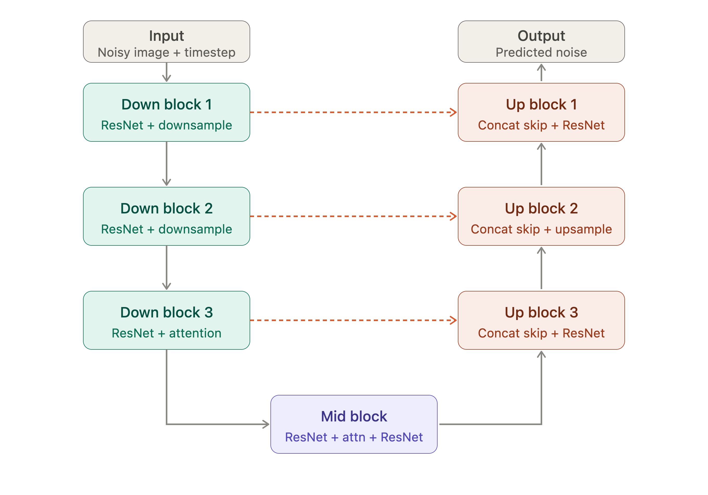

# DDPM

## Architecture



The core idea: it's a symmetric encoder-decoder where every down-block saves its output before downsampling, and the corresponding up-block concatenates that saved tensor before its own convs. Timestep info gets injected into every ResNet block along the way (not drawn — it'd clutter the diagram, but it matters).

Here's the pseudo-code skeleton, concise enough to leave the real implementation work to you:

```txt
# --- Timestep embedding ---
def time_embed(t):
    e = sinusoidal_embedding(t, dim)      # like transformer positional encoding
    e = Linear(e) -> SiLU -> Linear(e)    # small MLP, dim -> 4*dim -> dim
    return e

# --- ResNet block (the workhorse, repeated everywhere) ---
def resnet_block(x, t_emb):
    h = GroupNorm(x) -> SiLU -> Conv3x3(h)
    h = h + Linear(t_emb)[:, :, None, None]   # inject time info
    h = GroupNorm(h) -> SiLU -> Conv3x3(h)
    return h + skip_conv(x)   # skip_conv = identity or 1x1 conv if channels change

# --- Attention block (only at lower resolutions) ---
def attn_block(x):
    h = GroupNorm(x)
    q, k, v = project(h)               # 1x1 convs
    h = softmax(q @ k.T / sqrt(d)) @ v  # standard self-attention over spatial positions
    return x + project_out(h)

# --- Down block ---
def down_block(x, t_emb, has_attn):
    x = resnet_block(x, t_emb)
    if has_attn: x = attn_block(x)
    skip = x                      # SAVE this for the matching up block
    x = downsample(x)             # strided conv or avgpool, halves H,W
    return x, skip

# --- Mid block ---
def mid_block(x, t_emb):
    x = resnet_block(x, t_emb)
    x = attn_block(x)
    x = resnet_block(x, t_emb)
    return x

# --- Up block ---
def up_block(x, skip, t_emb, has_attn):
    x = upsample(x)                    # nearest/transpose conv, doubles H,W
    x = concat([x, skip], dim=channel) # this is the U-Net magic
    x = resnet_block(x, t_emb)
    if has_attn: x = attn_block(x)
    return x

# --- Full forward pass ---
def unet_forward(x, t):
    t_emb = time_embed(t)
    x = conv_in(x)

    skips = []
    for block in down_blocks:
        x, s = down_block(x, t_emb, ...)
        skips.append(s)

    x = mid_block(x, t_emb)

    for block in up_blocks:
        x = up_block(x, skips.pop(), t_emb, ...)   # pop in reverse order

    return conv_out(x)   # predicts noise, same shape as input
```

A few things that trip people up when reimplementing:

- Channel counts double each down-block and halve each up-block (e.g. 64→128→256→256, mirrored back).
- Skip concatenation means the up-block's resnet input channels = upsampled_channels + skip_channels, not just upsampled_channels — easy to get a shape mismatch here.
- Attention is usually only applied at the lower spatial resolutions (e.g. 16×16, 8×8), not every block — it's O(N²) in pixel count.
- The time embedding MLP output gets added (not concatenated) inside every single ResNet block, both down and up.